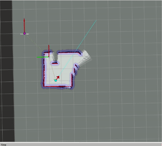
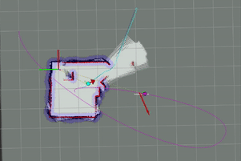
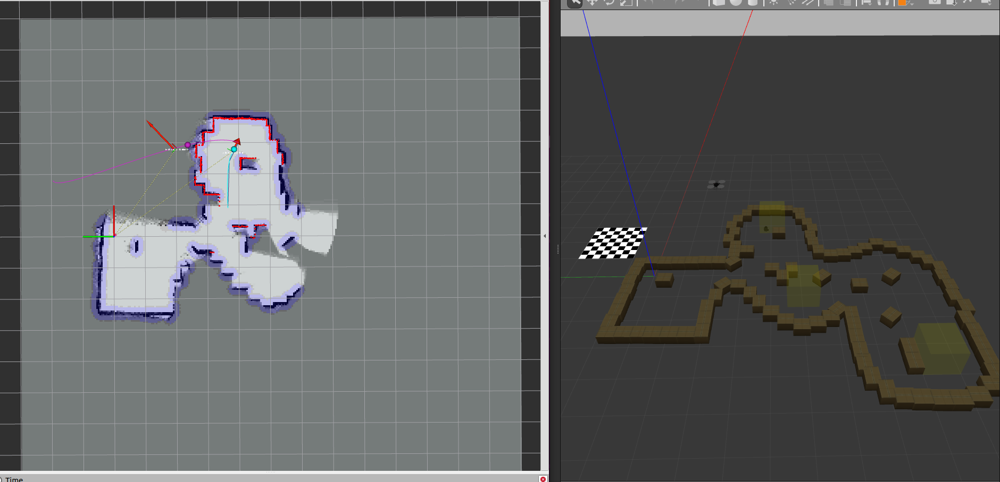

# Robot-Control-Planning-Navigation
[](https://github.com/mukundbala/Robot-Control-Planning-Navigation/actions/workflows/main.yml)

This repository contains from scratch implementation of planning and control techniques for differential drive robots (part 1) and quadrotors (part 2) in C++
Tested on Ubuntu 20.04 for ROS Noetic and compiled with C++17.

There are 3 simulation modes that can be used. Mode 1 spawns the Turtlebot and can run waypoint based missions for the Turtlebot. Mode 2 spawns the Hector Quadrotor only and can run waypoint based missions for the Hector Quadrotor. Mode 3 spawns both Turtlebot and Hector and can run co-op missions.

# How to build

```bash
##but first, some dependencies

sudo apt install python3-catkin-tools
sudo apt install ros-noetic-plotjuggler-ros

#ensure that you have ros-noetic installed: http://wiki.ros.org/noetic/Installation/Ubuntu
```
Clone workspace
```bash
cd ~
mkdir -p catkin_ws/src ##note that you dont have to use "catkin_ws"
cd ~catkin_ws/src
git clone git@github.com:mukundbala/Robot-Control-Planning-Navigation.git
```
Build workspace using catkin build
```bash
catkin build
```

```bash
source ~/catkin_ws/devel/setup.bash
```
# Implementation
## (A) Differential Drive Robot
This is a from scratch implementation of core features for autonomous navigation of a differential drive robot using the TurtleBot. Packages like move_base and ROS navigation were deliberately not used, hence "from scratch".
### **Features**:

#### **(1) Weighted Average Motion Filter**
Uses joint states and differential drive motion model to to perform localization. In *loco_mapping* package.

#### **(2) Logs Odd Bayes Filter for Occupancy Grids**
Bayesian update using logs odd Bayes Filter for map is used to update belief of the environment in 2D space. In *loco_mapping* package.

#### **(3) Mission Planner**
Tracks whether the TurtleBot has achieved its goal, and publishes new goals. Mission Planner can also update its internal list of goals based on feedback from Global Planner. This happens when the PERCEIVED location of the goal lies in an occupied cell on the occupancy grid, something generally caused by odometry drifts. In *mission_planner* package.

#### **(4) Global Planner: AStar with Post-Processing**
Global planner recives a goal and plans a path to the goal using AStar. Astar paths a post-processed to make paths more any-angle. Found in *global_planner* package.

#### **(5) Global Planner: Djikstra**
Djikstra is used as a backup planner to find the nearest free cell when either TurtleBot is on an occupied cell or when the goal is on an occupied cell. For the latter case, a service is used to update the mission planner's internal list of goals. Found in *global_planner* package.

#### **(6) Commander**
Commander gets a path from the Global Planner and generates a trajectory, which comprises of an array of targets. Trajectory generation is done using either Linear Interpolation, Cubic Hermite Spline or Quintic Hermite Spline. These can be set in the *config/trajectory.yaml* in the *commander* package.

#### **(7) PID Controller**
The PID controller runs on the same level (same ros node) as the commander. It takes in the current target issued by the trajectory generator, and generates command velocities. Bidirectional motion is allowed here, where the turtlebot will simply reverse to the goal rather than turning around. Found in *commander* package.

#### **(8) tmsgs**
The tmsgs package contains purely message and service files for communication between nodes.


## (B) Hector Quadrotor
This is a from scratch implementation of drone autonomous navigation. The implementation was simplified by consider the quadrotor as a 4DOF system, where we only consider X,Y,Z and Yaw. We assume that the robot frame Z-axis is always parallel to world frame Z-axis. This eliminates pitch and roll.

### **Features**:

#### **(1) Drone Commander**
The Drone Commander can be found in *drone_commander* package. The drone_commander node runs a Finite State Machine, trajectory generator and PID controller. Cubic or Quintic hermite splines can be used.

#### **(2) Drone INS**
The Drone INS, or Drone Inertial Navigation System, uses an Extended Kalman Filter for pose estimation by fusing GPS,Sonar,Barometer and Magnetometer. Found in *drone_ins* package.

#### **(3) hmsgs**
The hmsgs contains a single message to publish a Goal message, which contains the ID of the goal and the position. This is not used for anything other than logging and debugging on RViz.

## (C) Common Features
#### **(1) robot_bringup**
This package contains everything you would need to set worlds and waypoints. This is common for both Differential Drive and Quadrotor. At its core, bringup_robots.launch spawns the robot/robots according to the chosen simulation modes, while run_robots.launch starts the control and navigation stack nodes.

#### **(2) bot_utils**
Bot utils package (*bot_utils*) is a library containing common functions and data structures that can be used for both Quadrotor and Differential Drive.

#### **(3) Usage of .sh files**
Bash files are used to toggle between solo turtlebot, solo drone and co-op where the drone and turtle are spawned together to do some task. You can also set the world you want to launch here.

**================================**
# Simulation Modes

## Mode1: Solo Turtlebot
This mode allows only the Turtlebot to be spawned in a world. Waypoints can be set and the Turtlebot will map the environment and travel to each of the waypoints in sequence.

<p align="center">
  
</p>
<p align="center">Solo Turtlebot Waypoint-based mission</p>

## Mode 2: Solo Hector Quadrotor
This mode is primarily meant to test out Hector's Finite State Machine and Trajectory Generation. This mode allows waypoint based flight for the Hector. Only the hector will be spawned in this mode. This mode was used to tune the PID gains of the Hector

<p align="center">
  
</p>
<p align="center">Solo Hector Quadrotor Waypoint-based Flight</p>

## Mode 3: Coupled Co-op Flights
During Co-op flights, the Hector will chase after the Turtle and fly to its position. The Hector then flies to the final goal of the Turtle before flying back to the Takeoff Point. A naive approach might be to simply get the Turtle's position and fly to it. However, this can create unnecessarily long flight paths.

Alternately, we can fly to where the Turtle is *going to be* in the future. This is done by getting the published trajectory of the turtle. These trajectories can be Linear, Cubic or Quintic splines. The commonality is that targets in these trajectories are generated over a fixed *dt*. We can exploit this to find a point on the trajectory from the Turtle's current target where both the Turtle and the Hector will reach at around the same time.


<p align="center">
  
</p>
<p align="center">Chasing the Turtlebot using spline-based prediction</p>

<p align="center">
  
</p>
<p align="center">Hector and Turtlebot missions</p>

# How to Use
## Adding World Files and goals for different modes
1. Go to robot_bringup/worlds
- Each world file that is added has its own directory,<world_name>. This directory contains a *<world_name>.sh file*,*<world_name>_tgoals.yaml*,*<world_name>_hgoals.yaml* file and a *<world_name>.world* file.

- The configuration for these files according to the chosen mode are explained below
    - For **Mode 1: Solo Turtlebot**
        - *<world_name>.sh file*
            ```bash
            ## spawning coordinates for Turtlebot
            export TURTLE_X=-2.0 
            export TURTLE_Y=-0.5

            ## map limits for turtlebot
            export TURTLE_MIN_X=-8.0
            export TURTLE_MIN_Y=-13.0
            export TURTLE_MAX_X=7.0
            export TURTLE_MAX_Y=3.0
            ```
        - *<world_name>_tgoals.yaml file*
            ```yaml
            goals: 
            - [3.0 , -4.0]
            - [-1.0 , -5.0]
            - [-3.5 , -8.5]
            ```
        - *<world_name>.world* follows the usual .world file format

    - For **Mode 2: Solo Hector Quadrotor**
        - *<world_name>.sh file*
            ```bash
            ## spawning coordinates for Hector Quadrotor
            export HECTOR_X=0.0
            export HECTOR_Y=0.0
            export HECTOR_Z=0.178
            ```
        - *<world_name>_hgoals.yaml file*
            ```yaml
            goals: 
            - [1.0, 1.0, 2.0]
            - [5.0 , 5.0 , 2.0]
            - [1.0 , 1.0 , 2.0]
            ```
    - For **Mode 3 (3a and 3b): Co-Op Hector + Turtlebot**
        - *<world_name>.sh file*
            ```bash
            export TURTLE_X=-2.0
            export TURTLE_Y=-0.5
            export TURTLE_MIN_X=-8.0
            export TURTLE_MIN_Y=-13.0
            export TURTLE_MAX_X=7.0
            export TURTLE_MAX_Y=3.0
            export HECTOR_X=2.0
            export HECTOR_Y=2.0
            export HECTOR_Z=0.178
            ```
        - *<world_name>_tgoals.yaml file*
            ```yaml
            goals: 
            - [3.0 , -4.0]
            - [-1.0 , -5.0]
            - [-3.5 , -8.5]
            ```
        - *<world_name>_hgoals.yaml* contain the goals for the Hector Quadrotor
            - **mode3a** (Coupled Navigation)
                ```yaml
                goals: 
                ```
            - **mode3b** (Decoupled Navigation)
                ```yaml
                goals: 
                - [1.0, 1.0, 2.0]
                - [5.0 , 5.0 , 2.0]
                - [1.0 , 1.0 , 2.0]
                ```
    
2. In this directory (*robot_bringup/worlds*), create a directory with the worldname that you want, such that *robot_bringup/worlds/<world_name>*. World name can be pretty much anything, but make sure this <world_name> is used for all files inside the directory.

3. Depending on which mode you want the world to be used in, add in the relevant fields detailed in Step 1

4. It is recommended that for different modes, you create different <world_name> folders even if the same .world file is being used.

## Mode 1: Solo Turtlebot
This mode will spawn a Turtlebot in a world, and it will navigate from its spawn location to each of the goal locations that were set.

1. Follow the instructions in the Adding World Files section. Make sure you follow the fields for **Mode 1**
2. Go to *params.sh* and add in the <world_name> in the **WORLD** field and "mode1" to the **TASK** field.
3. Run catkin build if you made any changes to the code
4. Open 2 terminals. Make sure you runs source devel/setup.bash in each terminal
5. In the first terminal, run ./bringup.sh
6. Once Gazebo and Rviz have launched, run ./run.sh in the second terminal
7. The Turtlebot will begin its mission


## Mode 2: Solo Hector Quadrotor
This mode will spawn a Hector Quadrotor in a world, and it will navigate from its spawn location to each of the goal locations that were set.

1. Follow the instructions in the Adding World Files section. Make sure you follow the fields for **Mode 2**
2. Go to *params.sh* and add in the <world_name> in the **WORLD** field and "mode2" to the **TASK** field.
3. Go to *drone_commander/config/drone_commander.yaml* and set **co_op=false**. This is to trigger the solo flight Finite State Machine to run.
4. Run catkin build if you made any changes to the code
5. Open 2 terminals. Make sure you runs source devel/setup.bash in each terminal
6. In the first terminal, run ./bringup.sh
7. Once Gazebo and Rviz have launched, run ./run.sh in the second terminal
8. The Quadrotor will begin its mission


## Mode 3: Co-op Turtlebot + Hector Quadrotor
This mode spawn both the Hector and Turtlebot in the world. There are 2 "sub modes" in this mode, mode3a and mode3b that have different co-op behaviors

**In mode3a**, Hector's navigation is entirely coupled with the Turtlebot. The Hector will Takeoff, then fly to the Turtle's position, then fly to the Turtle's final goal.
It will then fly back to its Takeoff position. This pattern (Takeoff - Turtle - TurtleFinalWaypoint - Takeoff - ....) will continue UNTIL the Turtle has reached its final goal. It will then complete its current cycle, fly back to the Takeoff point, and Land.

**In mode3b**, the Hector's navigation is decoupled from the Turtlebot. The Hector will load in separate goals from *<world_name>_hgoals.yaml* and follow that instead. Its behavior will be identical to the behavior in Mode2.

The only difference in settings for mode3a and mode3b is in setting the **co_op field in *drone_commander/config/drone_commander.yaml* to true or false.**

### Mode3a: Coupled Mission
1. Follow the instructions in the Adding World Files section. Make sure you follow the fields for **Mode 3**.
2. Go to *params.sh* and add in the <world_name> in the **WORLD** field and "mode3" to the **TASK** field.
3. Go to *drone_commander/config/drone_commander.yaml* and set **co_op=true**. The State Machine will run a follow turtle sequence to fulfill the cycles
4. Run catkin build if you made any changes to the code
5. Open 2 terminals. Make sure you runs source devel/setup.bash in each terminal
6. In the first terminal, run ./bringup.sh
7. Once Gazebo and Rviz have launched, run ./run.sh in the second terminal
8. The Quadrotor and Turtlebot will begin their respective missions

### Mode3b: Decoupled Mission
1. Follow the instructions in the Adding World Files section. Make sure you follow the fields for **Mode 3**.
2. Go to *params.sh* and add in the <world_name> in the **WORLD** field and "mode3" to the **TASK** field.
3. Go to *drone_commander/config/drone_commander.yaml* and set **co_op=false**. The State Machine will run a waypoint follower sequence and fly independently of the Turtle
4. Run catkin build if you made any changes to the code
5. Open 2 terminals. Make sure you runs source devel/setup.bash in each terminal
6. In the first terminal, run ./bringup.sh
7. Once Gazebo and Rviz have launched, run ./run.sh in the second terminal
8. The Quadrotor and Turtlebot will begin their respective missions

Hector Flying around with the Turtle

Hector Chasing the Turtle

