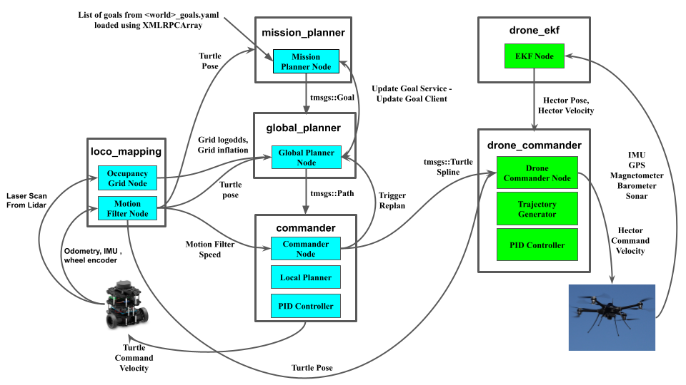
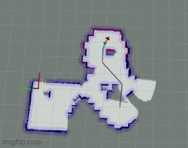
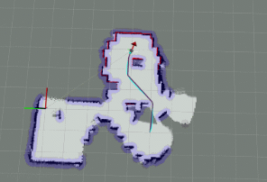
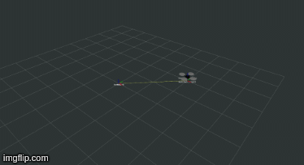
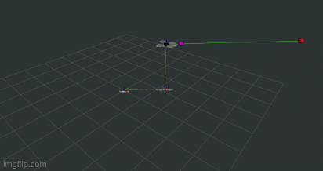
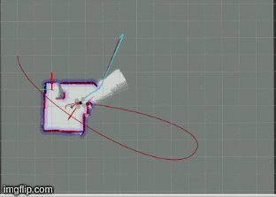
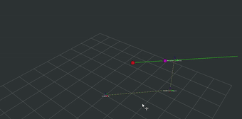
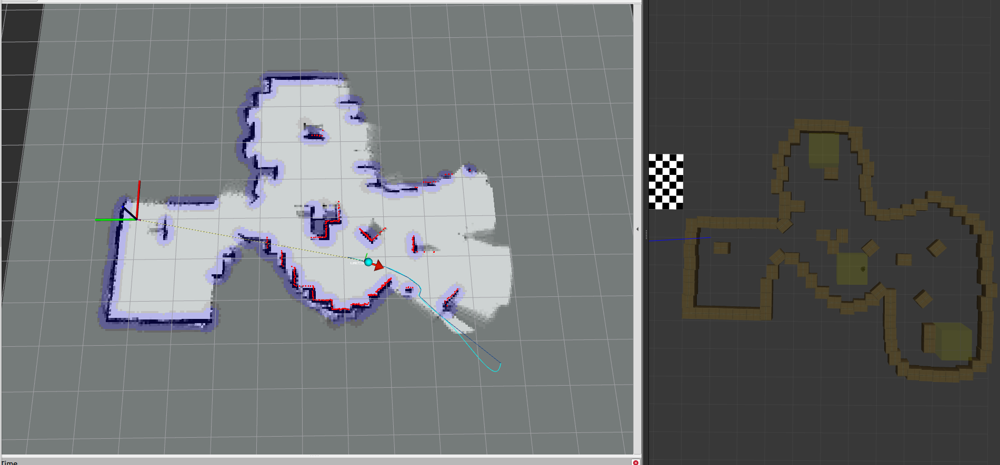
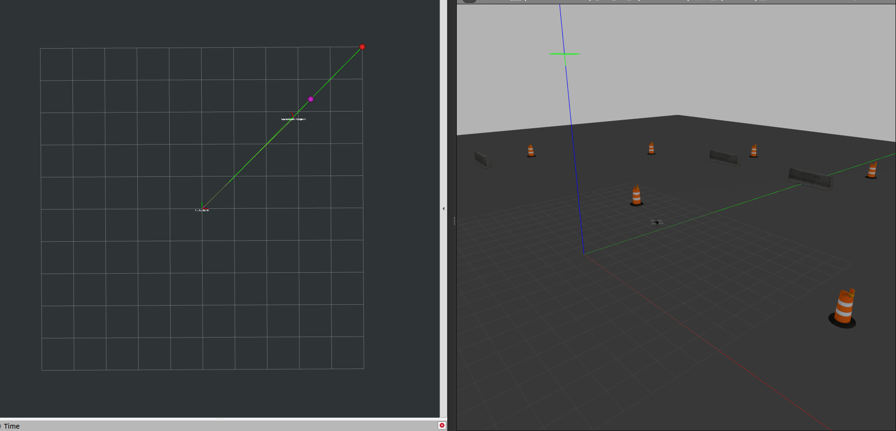
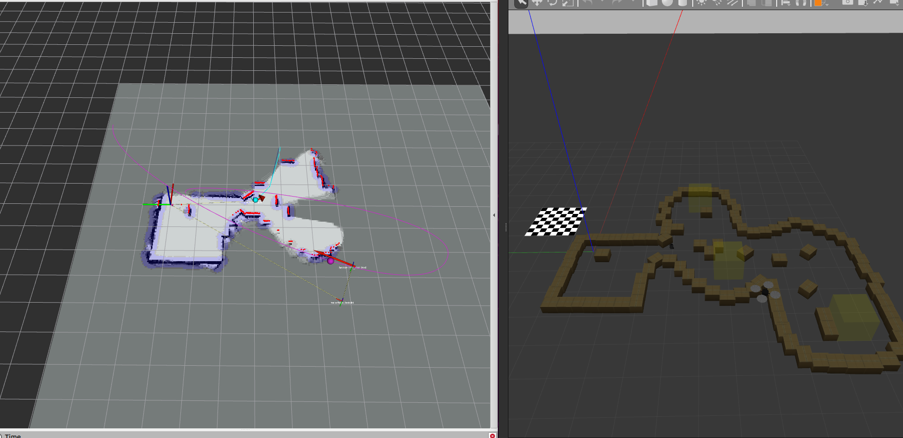

# Nav-Stack-From-Scratch
[](https://github.com/mukundbala/Robot-Control-Planning-Navigation/actions/workflows/main.yml)

**This project is a part of and an extension to EE4308 Autonomous Robot Systems course project at the National University of Singapore.**

This repository contains from-scratch implementations of robotics motion planning, control and mapping algorithms/techniques. The goal was to understand these algorithms from 1st principles and implement them in an efficient, yet readable manner. This "full stack" approach has been vital in building an indepth understanding of how these algorithms work under the hood, while also vastly improving my skills as a robotics software engineer. This work allows for decoupled waypoint based missions for both robots and coupled missions where the drone's path is dependent on the Turtlebot's path

All algorithms are implemented and tested on **C++17 on ROS Noetic** using **Gazebo** for simulation.

If you are just browsing, see **Sections (1-3)**. Build and usage instructions in **Sections (4-6)**
# (1) Architecture

<p align="center">
  
</p>
<p align="center">Figure 1: Software and Control Architecture</p>

# (2) Nav Stack in action
<p align="center">
  
</p>
<p align="center">Figure 2: TurtleBot3 Mapping and Navigation</p>

<p align="center">
  
</p>
<p align="center">Figure 3: Linear TurtleBot3 Trajectories</p>

<p align="center">
  
</p>
<p align="center">Figure 4: Cubic Hermite Spline TurtleBot3 Trajectories</p>

<p align="center">
  
</p>
<p align="center">Figure 5: Quintic Hermite Spline TurtleBot3 Trajectories</p>

<p align="center">
  
</p>
<p align="center">Figure 6: Hector Quadrotor Takeoff and Landing</p>

<p align="center">
  
</p>
<p align="center">Figure 7: Hector Quadrotor Solo Waypoint Flight</p>

<p align="center">
  
</p>
<p align="center">Figure 8: TurlteBot3 - Hector Co-Op Mission</p>

<p align="center">
  
</p>
<p align="center">Figure 9: Spline-Based Prediction</p>

<p align="center">
  
</p>
<p align="center">Figure 10: Without Spline-Based Prediction</p>

# (3) Algorithms/Techniques Implementations
## (a) Differential Drive Simple Localization
[Found in ***loco_mapping*** package.]

This implementation uses the velocity motion model of a differential drive robot to track the pose using odometry (dead reckoning). This is fused with IMU with a weighted average filter. This is generally does not perform well due to wheel slip etc, but is reasonable for the flat ground in simulation.

## (b) Occupancy Grid Mapping with Log Odds Binary Bayes Filter
[Found in ***loco_mapping*** package.]

This implementation uses lidar measurements to incrementally update the robot's belief of the occupancy state of each grid on the map. Brensenham's Line Algorithm combined with the inverse sensor model is heavily used accomplish this. The occupancy map is also inflated to permit point mass assumption and allow safe navigation.

## (c) Mission Planner
[Found in ***mission_planner*** package.]

Mission Planner is a top level controller that loads waypoints from .yaml file. The completion of each waypoint is tracked, and the next waypoint is published only when the current waypoint is completed. This node shuts off all other nodes when all checkpoints have been achieved.

## (d) tmsgs and hmsgs
[Found in ***tmsgs*** and ***hmsgs***  packages.]

Custom .msg and .srv files for communication for TurtleBot3 and Hector Quadrotor. Generally good practice is write these messages as separate topics. This should be followed for extensions with different robots.

## (e) Global Planner
[Found in ***global_planner*** package]

Global Planner is a package that contains planning algorithms and the main global planner logic.

- ### (e.1) Global Planner Logic
    The main global planner logic gets a new waypoint from mission planner, and uses the current position of the robot along with the current map state to compute a path. This path is published. Main logic is found in GlobalPlanner::run().

    The type of planner used is polymorphically selected at runtime from global_planner.yaml config files.

- ### (e.2) GridPlannerCore
    This class is the base class grid planner pure interface that **enforces plan(.), post_process_path(.) and generatePath(.) methods for its children**. It also implements common functions and data structures that planners would need.

- ### (e.3) OpenList
    The implementation of OpenList uses a **min heap implemented using std::priority_queue**, with 3 sorting modes that can be selected in the config files. Note that some planners require a certain cost mode to work. The OpenList data structure is implemented in GridPlannerCore.

- ### (e.4) Grid Planners: Djikstra, Astar , ThetaStar
    3 Grid Based planners that inherit from GridPlannerCore have been implemented, and can be selected easily through config files.

- ### (e.5) Fallback Planner
    Grid-based planners plan based on map states, where they avoid grids that are occupied/inflated and explore cells that are free. Due to imperfections in odometry, the robot can find itself on occupied/inflated cells or its goal may appear on these cells. **This will cause the planner to always fail as these cells will be avoided**. A Fallback Planner, implemented using Djikstra, finds the nearest free cell from a given non-free cell, which the main planner uses to plan its path.

## (f) Commander
[Found in ***commander*** package]

The Local Planner receives a path from the Global Planner and generates a trajectory over the points on the path. It feeds targets on the trajectory to a PID controller to generate command velocities.

- ### (f.1) Commander Logic
    The commander receives a path from Global Planner and generates a trajectory over this path. It tests the trajectory and triggers replanning by the Global Planner if the robot is too close to a target that is on a non-free cell. The Commander selects a target and feeds it to the PID Controller. Once a target is reached, it feeds the next target.

- ### (f.2) Local Planner
    Trajectories are generated using ***C<sup>0</sup>* Continuous Linear Interpolation**, ***C<sup>1</sup>* Continuous Cubic Hermite Spline** or ***C<sup>2</sup>* Continuous Quintic Hermite Spline**. Choice of local planner algorithm is polymorphically set based on config file params.

- ### (f.3) PID Controller

    The PID Controller receives a target from the Local Planner and generates a command velocity using PID algorithm. The gains for the controller can be set in config params.

## (g) Drone Commander
[Found in ***drone_commander*** package]

The Drone Commander contains a high level **Finite State Machine (FNS)** for mission control and a mid-level **Trajectory Generator** and **PID Controller** for motion planning. It allows the drone to fly coupled missions with the TurtleBot3 or solo waypoint based missions.

- ### (g.1) FNS
    The FNS tracks the mission state of the Hector Drone and transitions to subsequent states to perform solo or coupled missions. 

- ### (g.2) Trajectory Generator
    Trajectories are generated using ***C<sup>0</sup>* Continuous Linear Interpolation**, ***C<sup>1</sup>* Continuous Cubic Hermite Spline** or ***C<sup>2</sup>* Continuous Quintic Hermite Spline**. Choice of local planner algorithm is polymorphically set based on config file params.

- ### (g.3) PID Controller

    The PID Controller receives a target from the Trajectory Generator and generates a command velocity using PID algorithm. The gains for the controller can be set in config params.

- ### (g.4) Spline Based Prediction

    For coupled Hector-TurtleBot3 missions, we may require the Hector to fly to the movign TurtleBot3. Rather than generating trajectories to the Turtle's position, we use the spline of the TurtleBot to compute a point on the spline that both Hector and TurtleBot can reach at the same time. Repeating this prediction at every time step creates shorter and faster trajectories for the Hector.

## (h) Drone Inertial Navigation System using EKF

The Drone Inertial Navigation System (INS) fuses GPS, IMU, Magnetometer, Barometer and Sonar measurements using an Extended Kalman Filter for pose estimation.

# (4) How to build

```bash
##but first, some dependencies

sudo apt install python3-catkin-tools
sudo apt install ros-noetic-plotjuggler-ros

#ensure that you have ros-noetic installed: http://wiki.ros.org/noetic/Installation/Ubuntu
```
Clone workspace
```bash
cd ~
mkdir -p catkin_ws/src ##note that you dont have to use "catkin_ws"
cd ~catkin_ws/src
git clone git@github.com:mukundbala/Robot-Control-Planning-Navigation.git
```

Dependencies
```md
1. Download the hector gazebo plugins and controllers here: 
**https://drive.google.com/drive/folders/1dpGfExLByJUMmeoGGoY88x6IGdUeHe9C?usp=sharing**

2. Move *hector* and *hector_quadrotor* folders into catkin_ws/src
```
Build workspace using catkin build
```bash
catkin build
```

```bash
source ~/catkin_ws/devel/setup.bash
```

# (5) Robots and Simulation
## (a) Overview
A **Differential Drive Robot (TurtleBot3)** and a **Hector Quadrotor** are simulated on Gazebo. There are options to spawn and control each robot individually, or run cooperative waypoint-based/coupled missions. Simulations, worlds, urdfs and simulation modes are all controlled by the ***robot_bringup*** package. 
## (b) ***robot_bringup*** package
In this package, utilities and files for launching, logging, visualization and simulation can be found. A brief overview is provided in this section. For this repository, this is the only package that will launch the simulation and the relevant nodes.

| Directory |                                                          Description                                                         |
|:---------:|:----------------------------------------------------------------------------------------------------------------------------:|
|  *launch* |          This directory contains launch files for simulations (bringup_robots.launch) and nodes (run_robots.launch)          |
| *logging* |                                             Logging config files for plotjuggler                                             |
|   *rviz*  |                                                       Rviz config files                                                      |
| *scripts* |              Contains python teleoperation scripts for Hector Quadrotor and TurtleBot3, written as python nodes              |
|   *src*   |                                            tf transform broadcaster for Turtlebot3                                           |
|   *urdf*  |                               Contains URDF descriptions of the robots used in this repository.                              |
|  *worlds* | Contains .world files of the simulation environment, spawn parameters (spawn location etc) and waypoint position in 2D or 3D |

## (c) ***supporting .sh files***
This repository extensively uses bash scripts to load paramters and run programs to avoid the common hassle of "sourcing" the ROS workspace etc. Generally, it helps with data collection purposes where these .sh files can be run repeatedly with different parameters.
|     Bash File    |                                                                                                                                                            Description                                                                                                                                                           |
|:----------------:|:--------------------------------------------------------------------------------------------------------------------------------------------------------------------------------------------------------------------------------------------------------------------------------------------------------------------------------:|
|    bringup.sh    |                                                                             Handles the boring stuff like sourcing workspace. More importantly, it loads (or sources in bash terms) simulation parameters and launches the bringup_robots.launch file                                                                            |
|      run.sh      | Handles the boring stuff like sourcing workspace. Resets Gazebo simulation so that we can immediately restart simulation without shutting off everything. Launch all relevant nodes according to the simulation mode using run_robots.launch file.Safely shuts down the simulation by directly publishing 0 velocities to robots |
|     params.sh    |                                                                          Contains 2 very important field: WORLD and TASK. WORLD refers to the chosen world in ***robot_bringup*** package, while TASK refers to the simulation mode (more on this later)                                                                         |
| teleop_turtle.sh |                                                                                              Launches TurtleBot3 teleoperation node. Directly publishes to /cmd_vel topic. You minimally need to bringup the simulation to use this.                                                                                             |
| teleop_hector.sh |                                                                                           Launches Hector Quadrotor teleoperation node. Directly publishes to /cmd_vel topic. You minimally need to bringup the simulation to use this.                                                                                          |
|  drone_logger.sh |                                                                                                                             Logging bash file that launches plotjuggler. Nothing too important here.                                                                                                                             |
**================================**


# (6) Simulation Modes

## Mode 1: Solo Turtlebot
This mode allows only the Turtlebot to be spawned in a world. Waypoints can be set and the Turtlebot will map the environment and travel to each of the waypoints in sequence.

## Mode 2: Solo Hector Quadrotor
This mode is primarily meant to test out Hector's Finite State Machine and Trajectory Generation. This mode allows waypoint based flight for the Hector. Only the hector will be spawned in this mode. This mode was used to tune the PID gains of the Hector

<!-- <p align="center">
  
</p>
<p align="center">Solo Hector Quadrotor Waypoint-based Flight</p> -->

## Mode 3: Coupled Co-op Flights
During Co-op flights, the Hector will chase after the Turtle and fly to its position. The Hector then flies to the final goal of the Turtle before flying back to the Takeoff Point. A naive approach might be to simply get the Turtle's position and fly to it. However, this can create unnecessarily long flight paths.

Alternately, we can fly to where the Turtle is *going to be* in the future. This is done by getting the published trajectory of the turtle. These trajectories can be Linear, Cubic or Quintic splines. The commonality is that targets in these trajectories are generated over a fixed *dt*. We can exploit this to find a point on the trajectory from the Turtle's current target where both the Turtle and the Hector will reach at around the same time.

# (7) How to Use
## Adding World Files and goals for different modes
1. Go to robot_bringup/worlds
- Each world file that is added has its own directory,<world_name>. This directory contains a *<world_name>.sh file*,*<world_name>_tgoals.yaml*,*<world_name>_hgoals.yaml* file and a *<world_name>.world* file.

- The configuration for these files according to the chosen mode are explained below
    - For **Mode 1: Solo Turtlebot**
        - *<world_name>.sh file*
            ```bash
            ## spawning coordinates for Turtlebot
            export TURTLE_X=-2.0 
            export TURTLE_Y=-0.5

            ## map limits for turtlebot
            export TURTLE_MIN_X=-8.0
            export TURTLE_MIN_Y=-13.0
            export TURTLE_MAX_X=7.0
            export TURTLE_MAX_Y=3.0
            ```
        - *<world_name>_tgoals.yaml file*
            ```yaml
            goals: 
            - [3.0 , -4.0]
            - [-1.0 , -5.0]
            - [-3.5 , -8.5]
            ```
        - *<world_name>.world* follows the usual .world file format

    - For **Mode 2: Solo Hector Quadrotor**
        - *<world_name>.sh file*
            ```bash
            ## spawning coordinates for Hector Quadrotor
            export HECTOR_X=0.0
            export HECTOR_Y=0.0
            export HECTOR_Z=0.178
            ```
        - *<world_name>_hgoals.yaml file*
            ```yaml
            goals: 
            - [1.0, 1.0, 2.0]
            - [5.0 , 5.0 , 2.0]
            - [1.0 , 1.0 , 2.0]
            ```
    - For **Mode 3 (3a and 3b): Co-Op Hector + Turtlebot**
        - *<world_name>.sh file*
            ```bash
            export TURTLE_X=-2.0
            export TURTLE_Y=-0.5
            export TURTLE_MIN_X=-8.0
            export TURTLE_MIN_Y=-13.0
            export TURTLE_MAX_X=7.0
            export TURTLE_MAX_Y=3.0
            export HECTOR_X=2.0
            export HECTOR_Y=2.0
            export HECTOR_Z=0.178
            ```
        - *<world_name>_tgoals.yaml file*
            ```yaml
            goals: 
            - [3.0 , -4.0]
            - [-1.0 , -5.0]
            - [-3.5 , -8.5]
            ```
        - *<world_name>_hgoals.yaml* contain the goals for the Hector Quadrotor
            - **mode3a** (Coupled Navigation)
                ```yaml
                goals: 
                ```
            - **mode3b** (Decoupled Navigation)
                ```yaml
                goals: 
                - [1.0, 1.0, 2.0]
                - [5.0 , 5.0 , 2.0]
                - [1.0 , 1.0 , 2.0]
                ```
    
2. In this directory (*robot_bringup/worlds*), create a directory with the worldname that you want, such that *robot_bringup/worlds/<world_name>*. World name can be pretty much anything, but make sure this <world_name> is used for all files inside the directory.

3. Depending on which mode you want the world to be used in, add in the relevant fields detailed in Step 1

4. It is recommended that for different modes, you create different <world_name> folders even if the same .world file is being used.

## Mode 1: Solo Turtlebot
This mode will spawn a Turtlebot in a world, and it will navigate from its spawn location to each of the goal locations that were set.

1. Follow the instructions in the Adding World Files section. Make sure you follow the fields for **Mode 1**
2. Go to *params.sh* and add in the <world_name> in the **WORLD** field and "mode1" to the **TASK** field.
3. Run catkin build if you made any changes to the code
4. Open 2 terminals. Make sure you runs source devel/setup.bash in each terminal
5. In the first terminal, run ./bringup.sh
6. Once Gazebo and Rviz have launched, run ./run.sh in the second terminal
7. The Turtlebot will begin its mission

<p align="center">
  
</p>
<p align="center">Figure 11: Mode 1</p>

## Mode 2: Solo Hector Quadrotor
This mode will spawn a Hector Quadrotor in a world, and it will navigate from its spawn location to each of the goal locations that were set.

1. Follow the instructions in the Adding World Files section. Make sure you follow the fields for **Mode 2**
2. Go to *params.sh* and add in the <world_name> in the **WORLD** field and "mode2" to the **TASK** field.
3. Go to *drone_commander/config/drone_commander.yaml* and set **co_op=false**. This is to trigger the solo flight Finite State Machine to run.
4. Run catkin build if you made any changes to the code
5. Open 2 terminals. Make sure you runs source devel/setup.bash in each terminal
6. In the first terminal, run ./bringup.sh
7. Once Gazebo and Rviz have launched, run ./run.sh in the second terminal
8. The Quadrotor will begin its mission

<p align="center">
  
</p>
<p align="center">Figure 12: Mode 2</p>

## Mode 3: Co-op Turtlebot + Hector Quadrotor
This mode spawn both the Hector and Turtlebot in the world. There are 2 "sub modes" in this mode, mode3a and mode3b that have different co-op behaviors

**In Mode 3a**, Hector's navigation is entirely coupled with the Turtlebot. The Hector will Takeoff, then fly to the Turtle's position, then fly to the Turtle's final goal.
It will then fly back to its Takeoff position. This pattern (Takeoff - Turtle - TurtleFinalWaypoint - Takeoff - ....) will continue UNTIL the Turtle has reached its final goal. It will then complete its current cycle, fly back to the Takeoff point, and Land.

**In Mode 3b**, the Hector's navigation is decoupled from the Turtlebot. The Hector will load in separate goals from *<world_name>_hgoals.yaml* and follow that instead. Its behavior will be identical to the behavior in Mode2.

The only difference in settings for mode3a and mode3b is in setting the **co_op field in *drone_commander/config/drone_commander.yaml* to true or false.**

### Mode 3a: Coupled Mission
1. Follow the instructions in the Adding World Files section. Make sure you follow the fields for **Mode 3**.
2. Go to *params.sh* and add in the <world_name> in the **WORLD** field and "mode3" to the **TASK** field.
3. Go to *drone_commander/config/drone_commander.yaml* and set **co_op=true**. The State Machine will run a follow turtle sequence to fulfill the cycles
4. Run catkin build if you made any changes to the code
5. Open 2 terminals. Make sure you runs source devel/setup.bash in each terminal
6. In the first terminal, run ./bringup.sh
7. Once Gazebo and Rviz have launched, run ./run.sh in the second terminal
8. The Quadrotor and Turtlebot will begin their respective missions

### Mode 3b: Decoupled Mission
1. Follow the instructions in the Adding World Files section. Make sure you follow the fields for **Mode 3**.
2. Go to *params.sh* and add in the <world_name> in the **WORLD** field and "mode3" to the **TASK** field.
3. Go to *drone_commander/config/drone_commander.yaml* and set **co_op=false**. The State Machine will run a waypoint follower sequence and fly independently of the Turtle
4. Run catkin build if you made any changes to the code
5. Open 2 terminals. Make sure you runs source devel/setup.bash in each terminal
6. In the first terminal, run ./bringup.sh
7. Once Gazebo and Rviz have launched, run ./run.sh in the second terminal
8. The Quadrotor and Turtlebot will begin their respective missions

<p align="center">
  
</p>
<p align="center">Figure 13: Mode 3</p>

